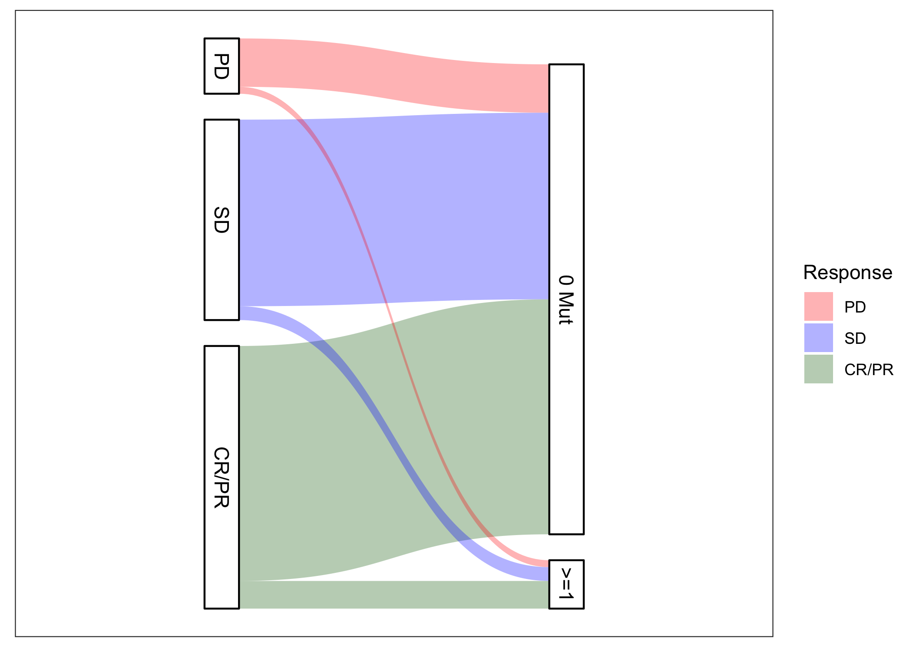

## About

The code in this repository is related to the manuscript "Resistance to Anti-EGFR Therapy Rechallenge in Extended RAS/RAF
Wildtype CRC Tumors is Mediated by Transcriptional Activation" by Parseghian, Sun, Woods, Napolitano, Alshenaifi, Willis,
Shen, Raghav, Nunez, Sorokin, Kanikarla, Morris, Vilar, Rehn, Ang, Troiani, and Kopetz.

The data were provided by Amgen and are thus only available upon request to the company. Once obtained, the data can be cleaned 
with the clean_data.Rmd file. This file will produce separate text files with the organized data. The analyze_data.Rmd file can
then be used to reproduce the numbers and figures in the manuscript such as the one below.

